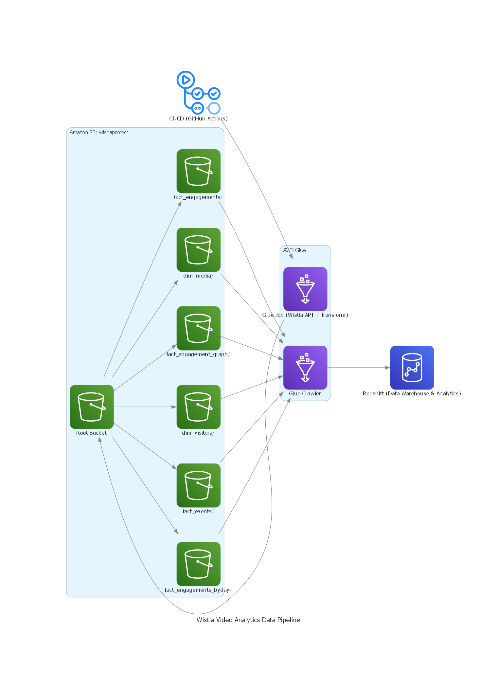

### 🎥 Wistia Video Analytics Pipeline with AWS Glue & Redshift

This project implements a full-stack data engineering pipeline that automates the extraction and analysis of video engagement data from the **Wistia Stats API**. The pipeline is orchestrated via **GitHub Actions** and executed nightly using **AWS Glue**, with all transformation logic written in **PySpark**. The processed data is stored in **Amazon S3** in a structured **dimensional model** (`dim_` / `fact_` tables) using the **Parquet** file format.

---

#### 🔧 Key Project Features

- **CI/CD with GitHub Actions**  
  The Glue job script is managed in a GitHub repository. Each code change is deployed automatically via a GitHub Actions workflow, which uploads the script to S3 and triggers or updates the Glue job definition accordingly.

- **ETL Orchestration with AWS Glue**  
  The Glue script runs nightly and performs the following:
  - Connects to the Wistia APIs using secure token-based authentication.
  - Pulls media-level and visitor-level analytics using Wistia’s endpoints (media details, engagement metrics, engagement by day, and raw events).
  - Implements pagination and date-based slicing to manage large payloads and optimize API performance.
  - Parses and cleans the data before writing it to S3 in Parquet format, split across logical folders for dimensional modeling (e.g., `dim_media/`, `fact_engagements/`, `fact_events/`, etc.).

- **Data Lake with Amazon S3**  
  All data is stored in a single S3 bucket, partitioned by folder prefixes representing individual dimension and fact tables. The storage is organized to support scalable downstream querying.

- **Metadata Cataloging with Glue Crawler**  
  A separate Glue crawler scans the S3 bucket and updates the AWS Glue Data Catalog with schema definitions, allowing external services like Redshift to query the data directly.

- **Data Warehouse with Amazon Redshift**  
  Redshift is connected to the Glue Catalog using an external schema, enabling analysts to write SQL queries against the raw and aggregated engagement data to generate charts, dashboards, and insights.

- **Extensible for Reporting**  
  The resulting data model supports use cases such as identifying high-performing media, analyzing viewer behavior by geography, and tracking engagement trends over time.

---

## 🧩 Architecture Overview



---

### Components

1. **Wistia Stats API** – Provides media, visitor, and event-level engagement data.  
2. **AWS Glue (PySpark)** – Fetches and transforms data (media, engagements, events, visitors) nightly with pagination and incremental logic.  
3. **Amazon S3** – Single-bucket object storage with folder-based structure (`dim_media`, `fact_engagements`, etc.) in Parquet format.  
4. **AWS Glue Crawler** – Catalogs S3 data and registers it into AWS Glue Data Catalog.  
5. **Amazon Redshift** – Connects to Glue Catalog as an external schema for querying.  
6. **GitHub Actions** – Automates deployment of Glue scripts and crawler execution.

---

## 🔧 Tech Stack

- **Python 3.x** – Used in Glue job to connect to Wistia API and handle processing  
- **AWS Glue (v3, PySpark)** – Batch processing and transformation  
- **Amazon S3** – Central data lake bucket with folder-based partitioning  
- **AWS Glue Crawler** – Metadata cataloging and schema creation  
- **Amazon Redshift** – Data warehouse for analysis and BI visualization  
- **GitHub Actions** – CI/CD pipeline for job deployment and orchestration  

---

## 🚀 Quickstart

### Requirements

- AWS account with access to Glue, S3, Redshift, and IAM  
- GitHub repo with [GitHub Actions](https://docs.github.com/en/actions) setup for deployment  
- Local Python 3 environment if testing scripts offline  

### Setup

```bash
git clone https://github.com/your-username/wistia-video-analytics.git
cd wistia-video-analytics
Update .github/workflows/deploy-glue-job.yml with your:
- S3 bucket name
- Glue job name
- IAM role ARN

### 🗂️ Data Model

#### `dim_media`
| Column       | Data Type | Description                  |
|--------------|-----------|------------------------------|
| id           | bigint    | Wistia numeric media ID      |
| name         | string    | Media title                  |
| type         | string    | Media type                   |
| archived     | boolean   | Whether the media is archived|
| created      | string    | Creation timestamp           |
| updated      | string    | Last update timestamp        |
| duration     | double    | Duration in seconds          |
| hashed_id    | string    | Hashed media ID              |
| description  | string    | Media description            |
| progress     | double    | Progress %                   |
| status       | string    | Status of the media          |
| thumbnail    | struct    | Thumbnail metadata           |
| section      | string    | Section/category name        |
| project      | struct    | Project info                 |
| assets       | array     | Media asset variations       |
| tags         | array     | Associated tags              |

#### `dim_visitors`
| Column      | Data Type | Description          |
|-------------|-----------|----------------------|
| visitor_id  | string    | Wistia visitor key   |
| ip_address  | string    | IP address           |
| country     | string    | Visitor country code |

#### `fact_engagements`
| Column        | Data Type | Description            |
|---------------|-----------|------------------------|
| media_id      | string    | Associated media ID    |
| date          | date      | Metric date            |
| load_count    | bigint    | Load count             |
| play_count    | bigint    | Play count             |
| play_rate     | double    | Play rate              |
| hours_watched | double    | Total hours watched    |
| engagement    | double    | Engagement score       |
| visitors      | bigint    | Total visitors         |

#### `fact_engagements_byday`
| Column        | Data Type | Description           |
|---------------|-----------|-----------------------|
| media_id      | string    | Media ID              |
| date          | string    | Date (YYYY-MM-DD)     |
| load_count    | bigint    | Load count            |
| play_count    | bigint    | Play count            |
| hours_watched | double    | Total hours watched   |

#### `fact_engagement_graph`
| Column           | Data Type | Description                      |
|------------------|-----------|----------------------------------|
| media_id         | string    | Associated media ID              |
| engagement       | double    | Overall engagement score         |
| engagement_data  | array     | Engagement data series           |
| rewatch_data     | array     | Rewatch heatmap data             |

#### `fact_events`
| Column               | Data Type | Description                      |
|----------------------|-----------|----------------------------------|
| received_at          | string    | Event timestamp (UTC)           |
| event_key            | string    | Unique event identifier         |
| region               | string    | Geographic region               |
| city                 | string    | City name                       |
| lat                  | double    | Latitude                        |
| lon                  | double    | Longitude                       |
| org                  | string    | Organization / ISP              |
| email                | int       | Email presence flag             |
| percent_viewed       | double    | % of media viewed               |
| embed_url            | string    | Source embed URL                |
| conversion_type      | string    | Conversion event type           |
| iframe_heatmap_url   | string    | Heatmap visual                  |
| visitor_key          | string    | Wistia visitor key              |
| user_agent_details   | struct    | Browser/device metadata         |
| media_id             | string    | Associated media ID             |
| media_name           | string    | Title of the media              |
| media_url            | string    | Direct URL to the media         |
| thumbnail            | struct    | Thumbnail metadata              |

### ⚙️ CI/CD with GitHub Actions

The repository includes a GitHub Actions workflow that:

- Uploads Glue job scripts to S3  
- Triggers the Glue job nightly  
- Logs status to CloudWatch  

# GitHub Actions workflow path
.github/workflows/deploy-glue-job.yml

### 📈 Example Use Cases

Once the data is cataloged in Glue and accessible via Redshift, you can:

- Track engagement trends by media and date  
- Identify highly active visitor regions  
- Monitor watch time performance by channel  
- Aggregate events per video for custom dashboards

### 📁 Repository Structure

```bash
.
├── scripts/                      # Glue job scripts
│   └── wistia_api_pipeline.py
├── diagrams/
│   └── architecture.png
├── .github/
│   └── workflows/
│       └── deploy-glue-job.yml
└── README.md


