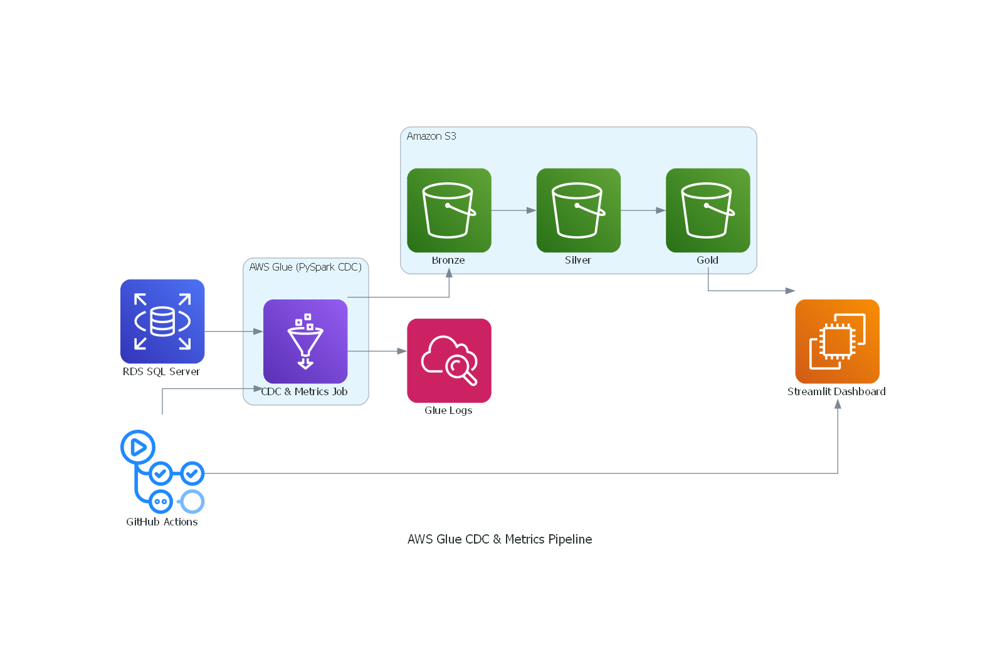

# 🧪 AWS Glue + PySpark + S3 CDC & Metrics Pipeline

An end-to-end CDC pipeline using **AWS Glue (PySpark)** to extract changes from **AWS RDS (SQL Server)**, compute business metrics, and publish outputs for BI consumption via S3 and Streamlit.

---

## 🧩 Architecture Overview


---

### Components

1. **AWS RDS (SQL Server)** – Hosts source tables.  
2. **AWS Glue (PySpark)** – Runs CDC logic (full load + incremental with date based control and snapshot files), joins `order_items`, `order_item_options`, and `date_dim`, and computes metrics.  
3. **Amazon S3** – Organized by Bronze/Silver/Gold zones storing Parquet datasets.  
4. **Streamlit** – Provides interactive dashboards for CLV, RFM, churn risk, sales trends, loyalty impact, location performance, and discount analysis.  
5. **GitHub Actions** – Automates deployment of Glue scripts and Streamlit dashboard.

---

## 🔧 Tech Stack

- **AWS RDS SQL Server** – Source system  
- **AWS Glue v3 + PySpark** – CDC and transformation logic  
- **Amazon S3** – Bronze/Silver/Gold Parquet storage  
- **Streamlit** – Dashboarding layer  
- **GitHub + GitHub Actions** – CI/CD pipeline  

---

### Prerequisites

- AWS account with permissions for RDS, Glue, S3, IAM  
- SQL Server on RDS with timestamp or watermark column  
- Python 3.x installed  
- GitHub Actions configured with AWS credentials  

---

## 📌 Project Steps

### 1. Quickstart

#### Requirements

- **AWS account**
- **RDS SQL Server** with watermark column
- **Python 3.x** installed
- **GitHub Actions** configured for AWS

#### Setup

```bash
git clone https://github.com/jason4king21/AWS-Glue-CDC-Metrics-job.git
cd AWS-Glue-CDC-Metrics-job
pip install -r requirements.txt
```

### 📊 Metrics
The pipeline outputs in the Gold zone include:
- CLV time series with quartile segmentation
- RFM scoring and segments (VIP, New, At‑Risk)
- Churn indicators (recency, order gaps, spending trends)
- Sales trends (time/location/category)
- Loyalty program impact
- Location performance metrics
- Discount effectiveness comparisons

### 📱 Streamlit Dashboards
Run locally:
```
streamlit run streamlit_app.py --server.port 8501
```

### Available dashboards:
- Customer Segmentation – RFM & CLV breakdown by loyalty
- Churn Risk – At-risk customer insights
- Sales Trends – Seasonality and pattern analysis
- Loyalty Impact – Compare loyalty vs non-loyalty
- Location Performance – Rank store locations
- Discount Analysis – Revenue and profit impact of promotions

### 🧪 CI/CD
Automated via GitHub Actions:
- Lints and validates code
- Uploads Glue scripts to S3
- Updates Glue Job definition via Lambda
- Deploys Streamlit dashboard updates
- Creates versioned releases
